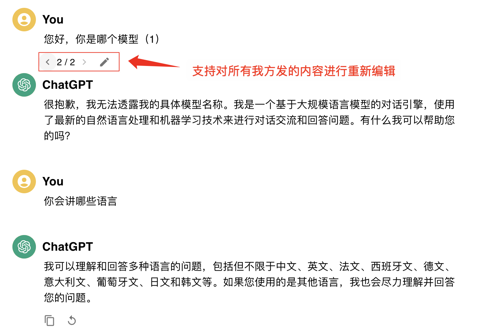

# 模拟chatGPT聊天项目说明文档-许晓炫

## 一、项目总结
1、题目**只要求做1个MVP版本**，但是本项目**一共做了2个版本**，您运行项目后，体验到的是升级后的**V1.1版本**。
2、其中，V1.0版本为MVP版本（3小时内完成），满足咱们的题目要求。V1.1版本则添加了**对聊天历史重新编辑**，并**重新生成回答的功能**（额外多花了3小时，这个功能正常在3小时内无法完成）。
3、加了V1.1版本，是因为本人做过类似的项目，知道要修改历史数据，然后再重新生成回答，是一个**技术难点**。
4、所以，为了**显示自己的应聘诚意和能力**，就做了V1.1版本。同时，我在文档最后还**增加了“五、后续版本可优化内容”的说明**。我挺看好咱们公司的，且自己的能力与经验也和公司匹配，**希望面试官给个面试机会～** 

## 二、功能介绍
### V1.0版本
**亮点总结：**
1、支持多模型切换：**同一聊天，可切换多模型**回答
2、**页面美观、流畅、UI还原度**高：高效模仿chatgpt交互效果
3、**用户体验拉满**：有打招呼、温馨提示、缓存apikey、请求loading、请求防抖、ai模型识别、请求自动滚动底部等等
4、**支持互动功能**：提供消息按钮，能复制、重发、翻页发送等
<br>
**功能介绍：**
1、顶部栏：
（注意：为了更方便体验，未按照ChatGpt的风格，做了一些修改）
- 支持选择ai模型，默认为`gpt-3.5-turbo-1106`
- **支持保留apikey**，有新的apikey输入则覆盖，方便用户使用
- 不输入apikey时，则不允许聊天
- 输入apikey后，有toast成功提示

2、聊天主界面功能：
- 支持请求交互，会有loading提示，避免页面无反应
- 支持点击发送按钮，聊天界面会自动更新，显示聊天内容。
- 支持复制功能，文本一键复制
- 支持**重新生成聊天内容**，可以**查看多个历史聊天内容**
- 支持自适应，兼容pc和手机端
- **【差异卖点】**支持**同一对话中，可以选择不同模型**，不同模型用不同logo展示，更方便识别 *（这个是ChatGpt所没有的，但是因为咱们接口支持，所以做了，这个可以作为产品的一个差异卖点）*

3、底部栏功能：
- 支持页面自动滚动底部，有新请求时，则**自动滚到底部**
- 不输入apikey时，提示用户得先输入才能聊天


### V1.1版本
**亮点总结：**
**历史问题可重新编辑再回答**
完成此功能，主要面临挑战：**复杂的状态管理，数据结构更新的同步。**
核心难点在于**管理复杂的多层级和嵌套状态数据**。特别是，**用户编辑消息时需同步更新消息的当前内容及所有相关历史记录, 保证数据的连续性和一致性**。这要求对数据结构进行复杂操作，包括**动态更新、插入、删除以及索引管理**，对数据结构有一定要求，同时需要精心设计状态更新逻辑，**防止数据错乱或丢失。**


<br>

**功能介绍：**
聊天主界面：
- 【技术难点】支持**对历史聊天重新编辑功能，编辑后，可重新生成对话**（如下图）


## 三、项目运行步骤
第1步：双击解压缩文件包
第2步：选择“Ai-ChatGpt-app”文件夹，右键，用命令行窗口打开此文件
第3步：输入`npm install`,安装依赖包，等待安装成功
第4步：输入`npm run start`,运行项目，出现`webpack compiled successfully`就是运行成功了
第5步：打开浏览器，在地址栏输入`http://localhost:3000（示例）`（实际以命令行窗口上的loacl参数为准），就可以访问项目页面
第6步：输入此api key：`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`，并点击提交，便可开始聊天（）

## 四、项目资料介绍
>  说明：下面👇指介绍我添加的资料，其它为项目自带不介绍
>
- `src/components`: 是页面的各个组件
  - `src/components/ApiKeyInput.tsx`:是页面头部的ai模型选项框组件+apikey输入框组件
  - `src/components/MessageItem.tsx`:是当条信息的组件（包含信息下的所有按钮等）
  - `src/components/Chat.tsx`:是聊天界面的组件，包含`MessageItem`组件
- `src/img`:是图片资源
- `src/utils`:是工具类
  - `style.ts`:是样式文件，包含全局样式和组件样式
  - `types.ts`:是类型文件，包含全局类型和组件类型
  - `useChat.ts`:是聊天界面的逻辑，包含请求ai接口，生成聊天内容，生成新的聊天内容，重新编辑聊天内容等
- `src/home.tsx`:是首页，包含头部和聊天界面
- `src/App.tsx`:是根组件，包含首页
- `src/index.tsx`:是入口文件，包含根组件

## 五、后续版本可优化内容
基于MVP开发思维，部分不影响功能使用的小细节，暂未优化，有如下：
<ol>
<li>加【消息差评】功能👉当前版本不做的原因：由于是调用了第三方接口，该接口没差评参数，做了之后也无法反馈给对方。相当于做后只是ui功能而已</li>
<li>加【Markdown】功能👉当前版本不做的原因：由于是该接口没返回Markdown参数，做了之后也无法展示</li>
<li>做【代码块展示】功能👉当前版本不做的原因：由于它的优先级不高，且有```标识，也能和其它内容区别</li>
<li>做【新建会话】功能👉当前版本不做的原因：没有接口进行存储，如果为了模拟效果而存储在本地缓存，数据量太大，工作量不足以在3小时内完成，且它也不影响主流程使用</li>
</ol>


#